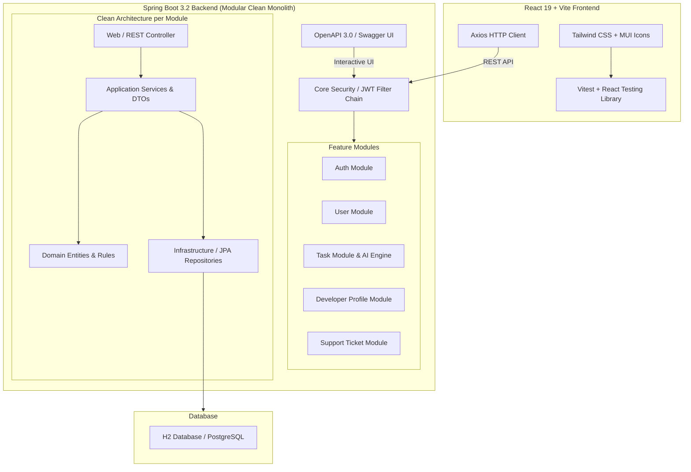

<div align="center">

  <h1>⚡ NEXORA</h1>
  <p><b>Next-Generation Intelligent Task & Resource Management System</b></p>
  <p><i>Powered by Modular Clean Monolith Architecture, Smart Developer-Skill Matching Engine, and Modern Web UI</i></p>

  <!-- Badges -->
  <p>
    <a href="#"></a>
    <a href="#"></a>
    <a href="#"></a>
    <a href="#"></a>
    <a href="#"></a>
    <a href="docs/postman_collection.json"></a>
    <a href="#"></a>
    <a href="#"></a>
    <a href="#"></a>
    <a href="#"></a>
  </p>

</div>

---

## 📌 Table of Contents

- [🌟 Project Overview](#-project-overview)
- [✨ Key Features](#-key-features)
- [🏛️ Architecture & System Design](#️-architecture--system-design)
  - [Backend Package Structure (Modular Clean Monolith)](#backend-package-structure-modular-clean-monolith)
- [📖 Interactive API Documentation (Swagger / Postman)](#-interactive-api-documentation-swagger--postman)
- [🧪 Testing & Code Coverage](#-testing--code-coverage)
- [💻 Tech Stack](#-tech-stack)
- [🚀 Quick Start Guide](#-quick-start-guide)
  - [Prerequisites](#prerequisites)
  - [Backend Setup (Spring Boot)](#1-backend-setup-spring-boot)
  - [Frontend Setup (React + Vite)](#2-frontend-setup-react--vite)
- [🔑 Default Credentials & Seed Data](#-default-credentials--seed-data)
- [📡 API Endpoints Overview](#-api-endpoints-overview)
- [🧠 Smart Assignment Algorithm](#-smart-assignment-algorithm)
- [🤝 Contributing & License](#-contributing--license)

---

## 🌟 Project Overview

**Nexora** is an enterprise-grade resource and task management platform designed to streamline collaboration between **Managers**, **Developers**, **Admins**, and **Clients**. It features an intelligent **AI-assisted developer matching algorithm** that automatically evaluates developer skill proficiency, active workload capacity, and task difficulty to recommend the optimal assignee for any task.

---

## ✨ Key Features

| Feature | Description | Icon |
| :--- | :--- | :---: |
| **Modular Clean Monolith** | Structured into bounded feature modules with strict Clean Architecture separation (Domain, Application, Infrastructure, Web). | 🏛️ |
| **Automated Testing Suite** | Complete unit and integration test suites for Java (JUnit 5 + Mockito + Jacoco) and React (Vitest + Testing Library). | 🧪 |
| **Interactive Swagger UI** | Complete OpenAPI 3.0 interactive documentation with Bearer JWT Authorization testing directly in browser. | 📖 |
| **Postman Collection** | Pre-configured `postman_collection.json` with automated token authorization scripts for instant testing. | 📬 |
| **Smart AI Task Matching** | Context-aware keyword extraction matching task descriptions against developer skill matrices and active workload points. | 🧠 |
| **Role-Based Access (RBAC)** | Granular authorization for `ADMIN`, `MANAGER`, `DEVELOPER`, and `CLIENT` roles secured via JWT. | 🔐 |
| **Skill & Workload Matrix** | Developers manage skills (levels 1–5), capacity points, experience levels (`JUNIOR`, `MID`, `SENIOR`), and bios. | 📊 |
| **Support Ticketing System** | Integrated client support ticket submission, tracking, and resolution workflow. | 🎟️ |

---

## 🏛️ Architecture & System Design

Nexora follows a **Layered Monolithic Architecture paired with Modular & Clean Architecture principles**. Instead of monolithic flat layers, code is partitioned into domain-bounded modules (`auth`, `user`, `task`, `developer`, `ticket`) and a shared `core` layer.



### Backend Package Structure (Modular Clean Monolith)

```
com.admin
├── 🛡️ core                             <-- Shared Infrastructure, Security & Config
│   ├── config                          (OpenAPIConfig - Swagger UI JWT Authorization)
│   ├── exception                       (GlobalExceptionHandler, ResourceNotFoundException)
│   ├── dto                             (PageResponse)
│   ├── security                        (SecurityConfig, JwtAuthenticationFilter)
│   └── seeder                          (DemoSeeder)
│
└── 📦 modules                          <-- Feature Bounded Modules
    ├── 🔐 auth                         (Authentication, JWT & Token Invites)
    │   ├── domain                      (InviteToken)
    │   ├── application                 (AuthService, JwtService, MailService, Auth DTOs)
    │   ├── infrastructure              (InviteTokenRepository)
    │   └── web                         (AuthController)
    │
    ├── 👤 user                         (User Identity & Account Management)
    │   ├── domain                      (User, Role)
    │   ├── application                 (UserService, User DTOs)
    │   ├── infrastructure              (UserRepository)
    │   └── web                         (AdminUserController)
    │
    ├── 📋 task                         (Tasks & AI Assignment Algorithm)
    │   ├── domain                      (TaskItem, TaskStatus, TaskPriority)
    │   ├── application                 (TaskAssignmentService, DeveloperTaskService, Task DTOs)
    │   ├── infrastructure              (TaskRepository)
    │   └── web                         (ManagerTaskController, DeveloperTaskController)
    │
    ├── 💻 developer                    (Developer Profiles & Skill Matrix)
    │   ├── domain                      (DeveloperProfile, DeveloperSkill, ExperienceLevel)
    │   ├── application                 (DeveloperProfileService, Profile DTOs)
    │   ├── infrastructure              (DeveloperProfileRepository, DeveloperSkillRepository)
    │   └── web                         (DeveloperProfileController)
    │
    └── 🎟️ ticket                       (Support Ticket Management)
        ├── domain                      (Ticket)
        ├── application                 (TicketService)
        ├── infrastructure              (TicketRepository)
        └── web                         (TicketController)
```

---

## 📖 Interactive API Documentation (Swagger / Postman)

Nexora provides full interactive API testing support out of the box.

### 🌐 1. Swagger UI (OpenAPI 3.0)

When the Spring Boot backend is running, access Swagger UI in your browser:

- **Swagger UI Interactive Page**: [`http://localhost:8081/swagger-ui.html`](http://localhost:8081/swagger-ui.html)
- **OpenAPI JSON Spec**: [`http://localhost:8081/v3/api-docs`](http://localhost:8081/v3/api-docs)

> 🔐 **Authentication in Swagger**: Click the **Authorize** button at the top right of Swagger UI, enter your JWT token received from `/api/auth/login` (format: `Bearer <your_token>`), and execute any protected endpoint interactively!

---

### 📬 2. Postman Collection File

We provide a complete pre-configured Postman Collection with automated JWT environment scripts.

[](docs/postman_collection.json)

**How to Import & Use**:
1. Open **Postman**.
2. Click **Import** $\rightarrow$ select [`docs/postman_collection.json`](docs/postman_collection.json).
3. Execute `🔐 Auth & Onboarding` $\rightarrow$ `Login (Admin)` (or Manager/Developer).
4. The test script automatically saves the `jwt_token` into collection variables!
5. Test any Admin, Manager, Developer, or Ticket API requests instantly.

---

## 🧪 Testing & Code Coverage

Nexora maintains strict software engineering quality standards with unit and integration tests across backend and frontend.

### ☕ Backend Unit & Integration Tests (JUnit 5 + Mockito + Jacoco)

```bash
# Run all backend unit & integration tests
cd backend
mvn test
```

- **Test Coverage Report**: Running `mvn test` automatically triggers the **JaCoCo plugin** and generates an HTML code coverage report at `backend/target/site/jacoco/index.html`.
- **Test Modules Covered**:
  - `TaskAssignmentServiceTest`: Validates AI developer matching engine, skill match scoring, workload capacity ratios, and experience tiers.
  - `AuthServiceTest`: Validates JWT token generation, password encoding, and authentication workflow.
  - `UserServiceTest`: Validates user directory filtering, pagination, and status updates.
  - `TicketServiceTest`: Validates ticket CRUD operations and exception handling.

### ⚛️ Frontend Component Tests (Vitest + React Testing Library)

```bash
# Run frontend Vitest test suite with coverage
cd frontend
npm run test
```

- **Test Framework**: Vitest + JSDOM + React Testing Library.
- **Component Tests**: Validates React UI forms, prop inputs, edit state population, and user event handlers.

---

## 💻 Tech Stack

### ⚙️ Backend
- **Language**: Java 17 (OpenJDK)
- **Framework**: Spring Boot 3.2.0
- **Testing**: JUnit 5, Mockito, Spring Boot Test, JaCoCo Coverage
- **API Docs**: Springdoc OpenAPI 3.0 (`springdoc-openapi-starter-webmvc-ui 2.3.0`)
- **Security**: Spring Security + Stateless JWT (`jjwt 0.11.5`)
- **Persistence**: Spring Data JPA + Hibernate 6
- **Database**: H2 Database (Local Dev) / PostgreSQL (Production)
- **Tooling**: Lombok, Apache Maven

### 🎨 Frontend
- **Framework**: React 19.2.0
- **Testing**: Vitest 1.3.1, React Testing Library, JSDOM
- **Build Tool**: Vite 6.0.0
- **Styling**: Tailwind CSS v4 + PostCSS
- **Icons**: MUI Material Icons & React Icons
- **Charts**: Recharts
- **HTTP Client**: Axios

---

## 🚀 Quick Start Guide

### Prerequisites
- **Java Development Kit (JDK 17+)** installed
- **Node.js (v18+)** and **npm** installed
- **Maven 3.8+** installed

---

### 1. Backend Setup (Spring Boot)

```bash
# Navigate to backend directory
cd backend

# Compile and run unit/integration tests with Jacoco coverage
mvn clean test

# Run Spring Boot server (Default port: 8081)
mvn spring-boot:run
```

> 💡 **H2 Console**: Available locally at `http://localhost:8081/h2` (JDBC URL: `jdbc:h2:file:./data/nexora-db`)  
> 📖 **Swagger UI**: Available locally at `http://localhost:8081/swagger-ui.html`

---

### 2. Frontend Setup (React + Vite)

```bash
# Navigate to frontend directory
cd frontend

# Install node dependencies
npm install

# Run Vitest test suite
npm run test

# Start Vite development server
npm run dev
```

> 🌐 Open your browser at `http://localhost:5173`

---

## 🔑 Default Credentials & Seed Data

On initial startup, `DemoSeeder` automatically seeds the database with the following demo accounts:

| Role | Email | Password | Access Rights |
| :--- | :--- | :--- | :--- |
| **Admin** 👑 | `admin@nexora.com` | `admin123` | Full user management, invite system, platform metrics |
| **Manager** 🎯 | `manager@nexora.com` | `manager123` | Task creation, AI assignee suggestions, team overview |
| **Developer** 💻 | `dev@nexora.com` | `dev123` | Assigned task board, profile & skill matrix management |

---

## 📡 API Endpoints Overview

### 🔐 Authentication (`/api/auth`)
- `POST /api/auth/login` — Authenticate user and receive JWT token
- `POST /api/auth/register` — Complete registration using invite token
- `GET  /api/auth/me` — Fetch current user details
- `GET  /api/auth/accept-invite` — Verify invite token info
- `POST /api/auth/accept-invite` — Set password and activate account

### 👤 Admin Users (`/api/admin/users`)
- `GET    /api/admin/users` — Paginated user directory with search/role filters
- `POST   /api/admin/users/invite` — Generate and email user invitation token
- `PATCH  /api/admin/users/{id}/status` — Enable or disable user account
- `DELETE /api/admin/users/{id}` — Delete user account safely

### 🎯 Manager Tasks (`/api/manager`)
- `GET  /api/manager/developers` — List developer team with skill matrix and workload
- `POST /api/manager/tasks/suggest` — Execute AI developer matching algorithm
- `POST /api/manager/tasks` — Create and assign new task
- `GET  /api/manager/tasks` — View manager created tasks

### 💻 Developer Board (`/api/developer`)
- `GET /api/developer/tasks` — List tasks assigned to logged-in developer
- `GET /api/developer/tasks/{id}` — Get single task details
- `GET /api/developer/profile` — View developer profile & skills
- `PUT /api/developer/profile` — Update bio, capacity, experience level & skills

---

## 🧠 Smart Assignment Algorithm

The task assignment engine calculates a weighted confidence score ($0.0 \rightarrow 1.0$) for candidate developers:

$$\text{Total Score} = 0.60 \times S_{\text{skill}} + 0.25 \times W_{\text{workload}} + 0.15 \times E_{\text{experience}}$$

1. **Skill Match ($S_{\text{skill}}$)**: Extracts domain keywords from task text (React, Node.js, Spring Boot, SQL, DevOps) and checks developer skill levels ($1 \rightarrow 5$).
2. **Workload Score ($W_{\text{workload}}$)**: Evaluates active task points against total capacity points ($1.0 - \frac{\text{Active Points}}{\text{Capacity Points}}$).
3. **Experience Fit ($E_{\text{experience}}$)**: Matches task estimated complexity against developer experience tier (`JUNIOR`, `MID`, `SENIOR`).

---

## 🤝 Contributing & License

Contributions are welcome! Please feel free to open issues or submit pull requests.

This project is licensed under the [MIT License](LICENSE).

<div align="center">
  <sub>Built by Sineth Dinsara</sub>
</div>
